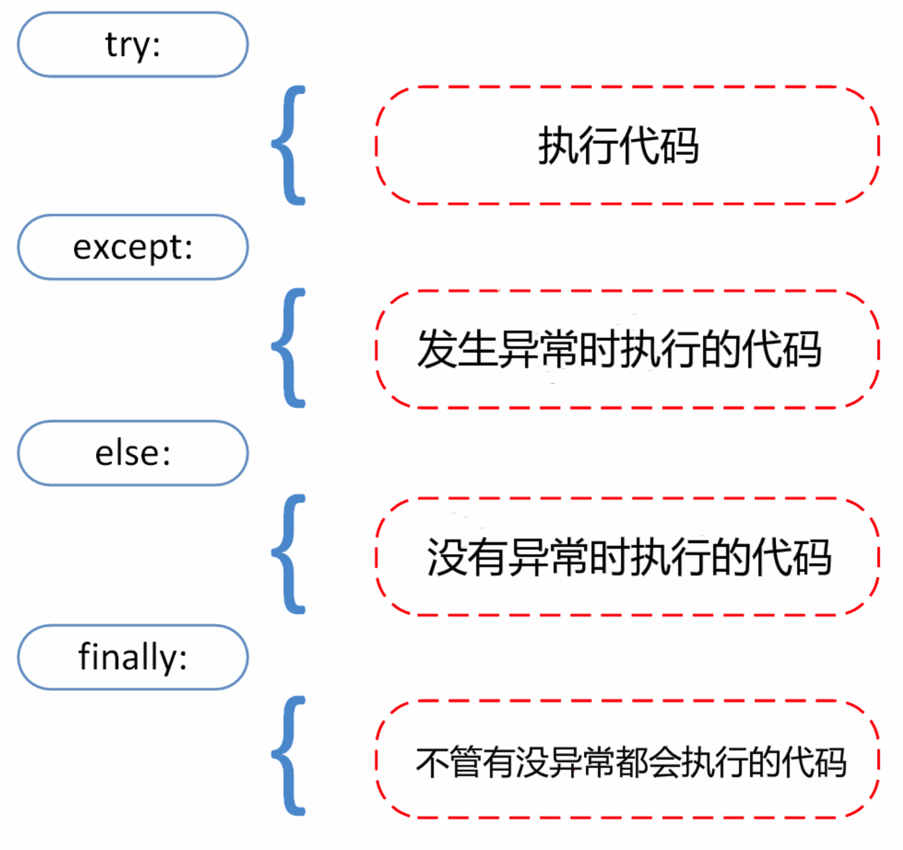

# 笔记

## print

```python
if (n := len(a)) > 10:
    print(f"List is too long ({n} elements, expected <= 10)")
```

## raw string

```python
>>> print('\n')       # 输出空行

>>> print(r'\n')      # 输出 \n
```

## if elif else

```python
if expression : 
   suite
elif expression : 
   suite 
else : 
   suite
```

## **print** 默认换行

不换行在末尾加 **end=" "**

```python
print( x, end=" " )
```

## import 与 from...import

将整个模块(somemodule)导入，格式为： **import somemodule**

从某个模块中导入某个函数,格式为： **from somemodule import somefunction**

从某个模块中导入多个函数,格式为： **from somemodule import firstfunc, secondfunc, thirdfunc**

将某个模块中的全部函数导入，格式为： **from somemodule import \***

## 帮助

```python
$ python -h
```

## 标准数据类型

Python3 中有六个标准的数据类型：

- Number（数字）
- String（字符串）
- List（列表）
- Tuple（元组）
- Set（集合）
- Dictionary（字典）

Python3 的六个标准数据类型中：

- **不可变数据（3 个）：**Number（数字）、String（字符串）、Tuple（元组）；
- **可变数据（3 个）：**List（列表）、Dictionary（字典）、Set（集合）。

T.plumage：

```python
print(isinstance(True, int))
# True
```

​	None对象

​	在Python中None不仅仅代表False，它本身就是一个特殊的空对象，可以用来占位

### Number（数字）

Python3 支持 **int、float、bool、complex（复数）**。

在Python 3里，只有一种整数类型 int，表示为长整型，没有 python2 中的 Long。

像大多数语言一样，数值类型的赋值和计算都是很直观的。

内置的 type() 函数可以用来查询变量所指的对象类型。

```python
>>> a, b, c, d = 20, 5.5, True, 4+3j
>>> print(type(a), type(b), type(c), type(d))
<class 'int'> <class 'float'> <class 'bool'> <class 'complex'>
```

此外还可以用 isinstance 来判断：

#### 实例

\>>> a = 111
\>>> isinstance(a, int)
True
\>>>

isinstance 和 type 的区别在于：

- type()不会认为子类是一种父类类型。
- isinstance()会认为子类是一种父类类型。

### del语句删除对象引用

```python
del var
del var_a, var_b
```

### list

list = [ 'abcd', 786 , 2.23, 'runoob', 70.2 ]
tinylist = [123, 'runoob']

**print** (list)       # 输出完整列表
**print** (list[0])     # 输出列表第一个元素
**print** (list[1:3])    # 从第二个开始输出到第三个元素
**print** (list[2:])     # 输出从第三个元素开始的所有元素
**print** (tinylist * 2)   # 输出两次列表
**print** (list + tinylist) # 连接列表

```python
>>> a[2:5] = [13, 14, 15]
>>> a[2:5] = []   # 将对应的元素值设置为 []
```

### **if** __name__ == "__main__"

### Tuple（元组）

与列表类似，不同之处在于元组的元素不能修改

### set 集合

可以使用大括号 **{ }** 或者 **set()** 函数创建集合，注意：创建一个空集合必须用 **set()** 而不是 **{ }**，因为 **{ }** 是用来创建一个空字典。

创建格式：

```
parame = {value01,value02,...}
或者
set(value)
```

### Dictionary（字典）

字典是一种映射类型，字典用 **{ }** 标识，它是一个无序的 **键(key) : 值(value)** 的集合

**print** (tinydict)      # 输出完整的字典
**print** (tinydict.keys())  # 输出所有键
**print** (tinydict.values()) # 输出所有值

## 数据类型转换

有时候，我们需要对数据内置的类型进行转换，数据类型的转换，你只需要将数据类型作为函数名即可，在下一章节 [Python3 数据类型转换](https://www.runoob.com/python3/python3-type-conversion.html) 会具体介绍。

以下几个内置的函数可以执行数据类型之间的转换。这些函数返回一个新的对象，表示转换的值。

| 函数                                                         | 描述                                                |
| :----------------------------------------------------------- | :-------------------------------------------------- |
| [int(x [,base\])](https://www.runoob.com/python3/python-func-int.html) | 将x转换为一个整数                                   |
| [float(x)](https://www.runoob.com/python3/python-func-float.html) | 将x转换到一个浮点数                                 |
| [complex(real [,imag\])](https://www.runoob.com/python3/python-func-complex.html) | 创建一个复数                                        |
| [str(x)](https://www.runoob.com/python3/python-func-str.html) | 将对象 x 转换为字符串                               |
| [repr(x)](https://www.runoob.com/python3/python-func-repr.html) | 将对象 x 转换为表达式字符串                         |
| [eval(str)](https://www.runoob.com/python3/python-func-eval.html) | 用来计算在字符串中的有效Python表达式,并返回一个对象 |
| [tuple(s)](https://www.runoob.com/python3/python3-func-tuple.html) | 将序列 s 转换为一个元组                             |
| [list(s)](https://www.runoob.com/python3/python3-att-list-list.html) | 将序列 s 转换为一个列表                             |
| [set(s)](https://www.runoob.com/python3/python-func-set.html) | 转换为可变集合                                      |
| [dict(d)](https://www.runoob.com/python3/python-func-dict.html) | 创建一个字典。d 必须是一个 (key, value)元组序列。   |
| [frozenset(s)](https://www.runoob.com/python3/python-func-frozenset.html) | 转换为不可变集合                                    |
| [chr(x)](https://www.runoob.com/python3/python-func-chr.html) | 将一个整数转换为一个字符                            |
| [ord(x)](https://www.runoob.com/python3/python-func-ord.html) | 将一个字符转换为它的整数值                          |
| [hex(x)](https://www.runoob.com/python3/python-func-hex.html) | 将一个整数转换为一个十六进制字符串                  |
| [oct(x)](https://www.runoob.com/python3/python-func-oct.html) | 将一个整数转换为一个八进制字符串                    |

## 推导式

- 列表(list)推导式
- 字典(dict)推导式
- 集合(set)推导式
- 元组(tuple)推导式
- https://www.runoob.com/python3/python-comprehensions.html

## 位运算符

https://www.runoob.com/python3/python3-basic-operators.html

## 逻辑运算符

and； or； not；

## 成员运算符

in； not in

```python
if ( a in list ):
   print ("1 - 变量 a 在给定的列表中 list 中")
   
if ( b not in list ):
   print ("2 - 变量 b 不在给定的列表中 list 中")
```

## 身份运算符

| 运算符 | 描述                                        | 实例                                                         |
| :----- | :------------------------------------------ | :----------------------------------------------------------- |
| is     | is 是判断两个标识符是不是引用自一个对象     | **x is y**, 类似 **id(x) == id(y)** , 如果引用的是同一个对象则返回 True，否则返回 False |
| is not | is not 是判断两个标识符是不是引用自不同对象 | **x is not y** ， 类似 **id(x) != id(y)**。如果引用的不是同一个对象则返回结果 True，否则返回 False。 |

## is 与 == 区别：

is 用于判断两个变量引用对象是否为同一个， == 用于判断引用变量的值是否相等。

## while 循环使用 else 语句

如果 while 后面的条件语句为 false 时，则执行 else 的语句块。

语法格式如下：

```python
while <expr>:
    <statement(s)>
else:
    <additional_statement(s)>
```

expr 条件语句为 true 则执行 statement(s) 语句块，如果为 false，则执行 additional_statement(s)。

如果你的while循环体中只有一条语句，你可以将该语句与while写在同一行中 ---> while (flag): print ('欢迎!')

## for 语句

Python for 循环可以遍历任何可迭代对象，如一个列表或者一个字符串。

for循环的一般格式如下：

```python
for <variable> in <sequence>:
    <statements>
else:
    <statements>
```

以下 for 实例中使用了 break 语句，break 语句用于跳出当前循环体：

### 实例

```python
#!/usr/bin/python3
 
sites = ["Baidu", "Google","Runoob","Taobao"]
for site in sites:
    if site == "Runoob":
        print("菜鸟教程!")
        break
    print("循环数据 " + site)
else:
    print("没有循环数据!")
print("完成循环!")
```

执行脚本后，在循环到 "Runoob"时会跳出循环体：

```
循环数据 Baidu
循环数据 Google
菜鸟教程!
完成循环!
```

### for i in range(5):

```python
for i in range(5):
  
for i in range(5,9):
  
for i in range(0, 10, 3):
  
for i in range(-10, -100, -30):
  
>>>a = ['Google', 'Baidu', 'Runoob', 'Taobao', 'QQ']
>>> for i in range(len(a)):
...     print(i, a[i])

# 创建一个列表：
>>>list(range(5))
[0, 1, 2, 3, 4]
```

### break 和 continue 语句及循环中的 else 子句

**break** 跳出 for 和 while 的循环体。如果你从 for 或 while 循环中终止，任何对应的循环 else 块将不执行。

**continue** 语句被用来告诉 Python 跳过当前循环块中的剩余语句，然后继续进行下一轮循环。

## pass

## 迭代器

迭代是Python最强大的功能之一，是访问集合元素的一种方式。

迭代器是一个可以记住遍历的位置的对象。

迭代器对象从集合的第一个元素开始访问，直到所有的元素被访问完结束。迭代器只能往前不会后退。

迭代器有两个基本的方法：**iter()** 和 **next()**。

字符串，列表或元组对象都可用于创建迭代器：

### 实例

```python
>>> list=[1,2,3,4]
>>> it = iter(list)    # 创建迭代器对象
>>> print (next(it))   # 输出迭代器的下一个元素
1
>>> print (next(it))
2
>>>
```

迭代器对象可以使用常规for语句进行遍历：

## 创建一个迭代器

https://www.runoob.com/python3/python3-iterator-generator.html

#### StopIteration

StopIteration 异常用于标识迭代的完成，防止出现无限循环的情况，在 __next__() 方法中我们可以设置在完成指定循环次数后触发 StopIteration 异常来结束迭代。

## 生成器

链接同上

调用一个生成器函数，返回的是一个迭代器对象。

## 函数

### 关键字参数

允许函数调用时参数的顺序与声明时不一致

```python
#!/usr/bin/python3
 
#可写函数说明
def printme( str ):
   "打印任何传入的字符串"
   print (str)
   return
 
#调用printme函数
printme( str = "菜鸟教程")
```

### 不定长参数

```python
def printinfo( arg1, *vartuple ):

# 还有一种就是参数带两个星号 **基本语法如下：
def functionname([formal_args,] **var_args_dict ):
  # 加了两个星号 ** 的参数会以字典的形式导入
```

声明函数时，参数中星号 ***** 可以单独出现，例如:

```python
def f(a,b,*,c):
    return a+b+c
```

如果单独出现星号 ***** 后的参数必须用关键字传入。

```python
>>> def f(a,b,*,c):
...     return a+b+c
... 
>>> f(1,2,3)   # 报错
Traceback (most recent call last):
  File "<stdin>", line 1, in <module>
TypeError: f() takes 2 positional arguments but 3 were given
>>> f(1,2,c=3) # 正常
6
>>>
```

## 匿名函数 lambda 

```python
x = lambda a : a + 10
print(x(5))
# 输出 15

sum = lambda arg1, arg2: arg1 + arg2
```

我们可以将匿名函数封装在一个函数内，这样可以使用同样的代码来创建多个匿名函数。

以下实例将匿名函数封装在 myfunc 函数中，通过传入不同的参数来创建不同的匿名函数：

```python
def myfunc(n):
  return lambda a : a * n
 
mydoubler = myfunc(2)
mytripler = myfunc(3)
 
print(mydoubler(11))
print(mytripler(11))
```

## 强制位置参数

Python3.8 新增了一个函数形参语法 / 用来指明函数形参必须使用指定位置参数，不能使用关键字参数的形式。

在以下的例子中，形参 a 和 b 必须使用指定位置参数，c 或 d 可以是位置形参或关键字形参，而 e 和 f 要求为关键字形参:

```python
def f(a, b, /, c, d, *, e, f):
    print(a, b, c, d, e, f)
```

## 列表可以修改，而字符串和元组不能

## 数据结构

https://www.runoob.com/python3/python3-data-structure.html

## 模块

下面是一个使用 python 标准库中模块的例子。

### 实例

```python
#!/usr/bin/python3
# 文件名: using_sys.py
 
import sys
 
print('命令行参数如下:')
for i in sys.argv:
   print(i)
 
print('\n\nPython 路径为：', sys.path, '\n')
```

\#!/usr/bin/python3 # 文件名: using_sys.py  import sys  print('命令行参数如下:') for i in sys.argv:   print(i)  print('\n\nPython 路径为：', sys.path, '\n')

执行结果如下所示：

```python
$ python using_sys.py 参数1 参数2
命令行参数如下:
using_sys.py
参数1
参数2

Python 路径为： ['/root', '/usr/lib/python3.4', '/usr/lib/python3.4/plat-x86_64-linux-gnu', '/usr/lib/python3.4/lib-dynload', '/usr/local/lib/python3.4/dist-packages', '/usr/lib/python3/dist-packages'] 
```

## 一个模块只会被导入一次

## import 语句

- import module1[, module2[,... moduleN]

- from … import ...

- from … import *

  这将把所有的名字都导入进来，但是那些由单一下划线（_）开头的名字不在此例。大多数情况， Python程序员不使用这种方法，因为引入的其它来源的命名，很可能覆盖了已有的定义。

## 深入模块

每个模块有各自独立的符号表，在模块内部为所有的函数当作全局符号表来使用。

所以，模块的作者可以放心大胆的在模块内部使用这些全局变量，而不用担心把其他用户的全局变量搞混。

从另一个方面，当你确实知道你在做什么的话，你也可以通过 modname.itemname 这样的表示法来访问模块内的函数。

## if __name__ == '__main__'

一个模块被另一个程序第一次引入时，其主程序将运行。如果我们想在模块被引入时，模块中的某一程序块不执行，我们可以用__name__属性来使该程序块仅在该模块自身运行时执行。

```python
#!/usr/bin/python3
# Filename: using_name.py

if __name__ == '__main__':
   print('程序自身在运行')
else:
   print('我来自另一模块')
```

## 目录只有包含一个 ____init____.py 的文件才会被认作是一个包

###  **____all____** 

以下实例在 file:sounds/effects/__init__.py 中包含如下代码:

```python
__all__ = ["echo", "surround", "reverse"]
```

这表示当你使用from sound.effects import *这种用法时，你只会导入包里面这三个子模块。

## 输出格式美化

Python两种输出值的方式: 表达式语句和 print() 函数。

第三种方式是使用文件对象的 write() 方法，标准输出文件可以用 sys.stdout 引用。


如果你希望输出的形式更加多样，可以使用 str.format() 函数来格式化输出值。

如果你希望将输出的值转成字符串，可以使用 repr() 或 str() 函数来实现。

- **str()：** 函数返回一个用户易读的表达形式。
- **repr()：** 产生一个解释器易读的表达形式。

https://www.runoob.com/python3/python3-inputoutput.html

##### **!a** (使用 **ascii()**), **!s** (使用 **str()**) 和 **!r** (使用 **repr()**) 可以用于在格式化某个值之前对其进行转化

## 读和写文件

open() 将会返回一个 file 对象，基本语法格式如下:

```python
open(filename, mode)
```

## try except

```python
while True:
    try:
        x = int(input("请输入一个数字: "))
        break
    except ValueError:
        print("您输入的不是数字，请再次尝试输入！")
```

一个except子句可以同时处理多个异常，这些异常将被放在一个括号里成为一个元组，例如:

```python
except (RuntimeError, TypeError, NameError):
    pass
```

最后一个except子句可以忽略异常的名称，它将被当作通配符使用。你可以使用这种方法打印一个错误信息，然后再次把异常抛出。

```python
import sys

try:
    f = open('myfile.txt')
    s = f.readline()
    i = int(s.strip())
except OSError as err:
    print("OS error: {0}".format(err))
except ValueError:
    print("Could not convert data to an integer.")
except:
    print("Unexpected error:", sys.exc_info()[0])
    raise
```

### try/except...else

**try/except** 语句还有一个可选的 **else** 子句，如果使用这个子句，那么必须放在所有的 except 子句之后。

else 子句将在 try 子句没有发生任何异常的时候执行。



```python
try:
    runoob()
except AssertionError as error:
    print(error)
else:
    try:
        with open('file.log') as file:
            read_data = file.read()
    except FileNotFoundError as fnf_error:
        print(fnf_error)
finally:
    print('这句话，无论异常是否发生都会执行。')
```

## 抛出异常

```python
raise [Exception [, args [, traceback]]]
raise NameError('HiThere')
```

raise 唯一的一个参数指定了要被抛出的异常。它必须是一个异常的实例或者是异常的类（也就是 Exception 的子类）。

如果你只想知道这是否抛出了一个异常，并不想去处理它，那么一个简单的 raise 语句就可以再次把它抛出。

#### 用户自定义异常

https://www.runoob.com/python3/python3-errors-execptions.html

你可以通过创建一个新的异常类来拥有自己的异常。异常类继承自 Exception 类，可以直接继承，或者间接继承，例如:

```python
>>> class MyError(Exception):
        def __init__(self, value):
            self.value = value
        def __str__(self):
            return repr(self.value)
   
>>> try:
        raise MyError(2*2)
    except MyError as e:
        print('My exception occurred, value:', e.value)
   
My exception occurred, value: 4
>>> raise MyError('oops!')
Traceback (most recent call last):
  File "<stdin>", line 1, in ?
__main__.MyError: 'oops!'
```

在这个例子中，类 Exception 默认的 __init__() 被覆盖。

当创建一个模块有可能抛出多种不同的异常时，一种通常的做法是为这个包建立一个基础异常类，然后基于这个基础类为不同的错误情况创建不同的子类:

```python
略
```

## 预定义的清理行为 --- with

一些对象定义了标准的清理行为，无论系统是否成功的使用了它，一旦不需要它了，那么这个标准的清理行为就会执行。

这面这个例子展示了尝试打开一个文件，然后把内容打印到屏幕上:

```python
for line in open("myfile.txt"):
    print(line, end="")
```

以上这段代码的问题是，当执行完毕后，文件会保持打开状态，并没有被关闭。

关键词 with 语句就可以保证诸如文件之类的对象在使用完之后一定会正确的执行他的清理方法:

```python
with open("myfile.txt") as f:
    for line in f:
        print(line, end="")
```

以上这段代码执行完毕后，就算在处理过程中出问题了，文件 f 总是会关闭。

## 面向对象

- **类(Class):** 用来描述具有相同的属性和方法的对象的集合。它定义了该集合中每个对象所共有的属性和方法。对象是类的实例。
- **方法：**类中定义的函数。
- **类变量：**类变量在整个实例化的对象中是公用的。类变量定义在类中且在函数体之外。类变量通常不作为实例变量使用。
- **数据成员：**类变量或者实例变量用于处理类及其实例对象的相关的数据。
- **方法重写：**如果从父类继承的方法不能满足子类的需求，可以对其进行改写，这个过程叫方法的覆盖（override），也称为方法的重写。
- **局部变量：**定义在方法中的变量，只作用于当前实例的类。
- **实例变量：**在类的声明中，属性是用变量来表示的，这种变量就称为实例变量，实例变量就是一个用 self 修饰的变量。
- **继承：**即一个派生类（derived class）继承基类（base class）的字段和方法。继承也允许把一个派生类的对象作为一个基类对象对待。例如，有这样一个设计：一个Dog类型的对象派生自Animal类，这是模拟"是一个（is-a）"关系（例图，Dog是一个Animal）。
- **实例化：**创建一个类的实例，类的具体对象。
- **对象：**通过类定义的数据结构实例。对象包括两个数据成员（类变量和实例变量）和方法。


