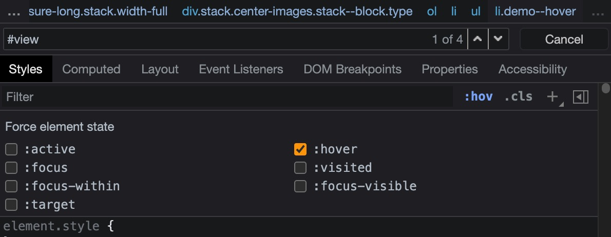

# 从查看和更改 DOM开始

发表于2019 年 3 月 1 日，星期五

完成前面那些交互式教程后，开始了解使用 Chrome DevTools 查看和更改页面 DOM 的基础知识。

本教程假设您知道 DOM 和 HTML 之间的区别。有关说明，请参阅[附录：HTML 与 DOM](https://developer.chrome.com/docs/devtools/dom/#appendix)。

## 查看 DOM 节点

Elements 面板的 DOM 树是您在 DevTools 中执行所有与 DOM 相关的活动的地方。

### 检查节点

当您对特定的 DOM 节点感兴趣时，**Inspect**是一种打开 DevTools 并调查该节点的快速方法。

1. 右键单击下面的**Michelangelo**并选择**Inspect**。

   - Michelangelo

   - Raphael

     

     DevTools的**Elements**面板打开。`Michelangelo`在**DOM 树**中突出显示。

     

     

2. 单击DevTools 左上角的**Inspect图标。**

   

3. 单击上面的Raphael文本。

   现在，`<li>Raphael</li>` 在 DOM 树中突出显示。

### 使用键盘导航 DOM 树

1. Up 和 Down 按钮可上下切换被选中的节点

2. Left 可折叠节点

3. Right 可展开节点

   

### 滚动查看

**滚动到视图**可让您快速重新定位视口，以便您可以看到节点。


### 搜索节点

您可以按字符串、CSS 选择器或 XPath 选择器搜索 DOM 树。

1. 将光标聚焦在**元素**面板上。

2. 按Control+F或Command+ F(Mac)。搜索栏在 DOM 树的底部打开。

3. 键入`The Moon is a Harsh Mistress`。最后一句话在 DOM 树中突出显示。

   

   如上所述，搜索栏还支持 CSS 和 XPath 选择器。

## 编辑 DOM

您可以即时编辑 DOM 并查看这些更改如何影响页面。

### 编辑内容

要编辑节点的内容，请双击 DOM 树中的内容。

在 DOM 树中，双击文本，文本以蓝色突出显示，表示它已被选中。


编辑后按Enter确认更改。

### 编辑属性

要编辑属性，请双击属性名称或值。按照以下说明了解如何将属性添加到节点。

如：双击`<Li>`。突出显示的文本表明该节点已被选中。


按Right箭头键，添加空格，键入`style="background-color:gold"`，然后按Enter。节点的背景颜色变为金色。


### 编辑节点类型

要编辑节点的类型，请双击该类型，然后键入新类型。

如：删除`li`，键入`button`，然后按Enter。``节点变为``节点。


### 重新排序 DOM 节点

拖动节点以重新排序。


### 强制状态

您可以强制节点保持在`:active`、`:hover`、`:focus`、`:visited`和 等状态`:focus-within`。

如：选中节点后，选择**Force State** > **:hover**




### 隐藏节点

按H隐藏节点。


再次按下 H 重新展示节点。


### 删除节点

按Delete删除节点。按Control+Z或Command+ Z(Mac)。最后一个动作被撤消，节点重新出现。


## 访问控制台中的节点

DevTools 提供了一些快捷方式，用于从控制台访问 DOM 节点，或获取对它们的 JavaScript 引用。


### 使用 $0 引用当前选择的节点

检查节点时，节点`== $0`旁边的文本表示您可以在控制台中使用变量引用该节点`$0`。


### 存储为全局变量

如果您需要多次引用某个节点，请将其存储为全局变量。

右键单击要存储的节点并选择**Store as global variable**。在控制台中输入`temp1`，然后按Enter。表达式的结果表明该变量计算为节点。


### 复制JS路径

当您需要在自动化测试中引用它时，将 JavaScript 路径复制到节点。

1. 右键单击 DOM 树中想要复制的节点，并选择**Copy** > **Copy JS Path**。解析为节点的`document.querySelector()`表达式已复制到剪贴板。

2. 按Control+V或Command+ V(Mac) 将表达式粘贴到控制台中，Enter。

   

## 中断 DOM 更改

DevTools 允许您在 JavaScript 修改 DOM 时暂停页面的 JavaScript。请参阅[DOM 更改断点](https://developer.chrome.com/docs/devtools/javascript/breakpoints/#dom)。


## 下一步

这涵盖了 DevTools 中与 DOM 相关的大部分功能。您可以通过右键单击 DOM 树中的节点并尝试本教程中未涵盖的其他选项来发现其余选项。另请参阅[元素面板键盘快捷键](https://developer.chrome.com/docs/devtools/shortcuts#elements)。

查看[Chrome DevTools 主页](https://developer.chrome.com/docs/devtools/)，了解您可以使用 DevTools 执行的所有其他操作。

如果您想联系 DevTools 团队或从 DevTools 社区获得帮助，请参阅社区[。](https://developer.chrome.com/docs/devtools/overview/#community)


## 附录：HTML 与 DOM

本节快速解释 HTML 和 DOM 之间的区别。

当您使用 Web 浏览器请求页面`https://example.com`时，服务器会返回如下 HTML：

```html
<!doctype html>
<html>
  <head>
    <title>Hello, world!</title>
  </head>
  <body>
    <h1>Hello, world!</h1>
    <p>This is a hypertext document on the World Wide Web.</p>
    <script src="/script.js" async></script>
  </body>
</html>
```

浏览器解析 HTML 并创建对象树，如下所示：

```text
html
  head
    title
  body
    h1
    p
    script
```

这种表示页面内容的对象或节点树称为 DOM。现在它看起来与 HTML 相同，但假设 HTML 底部引用的脚本运行以下代码：

```js
const h1 = document.querySelector('h1');
h1.parentElement.removeChild(h1);
const p = document.createElement('p');
p.textContent = 'Wildcard!';
document.body.appendChild(p);
```

该代码删除`h1`节点并将另一个`p`节点添加到 DOM。完整的 DOM 现在看起来像这样：

```text
html
  head
    title
  body
    p
    script
    p
```

页面的 HTML 现在与其 DOM 不同。换句话说，HTML 代表初始页面内容，而 DOM 代表当前页面内容。当 JavaScript 添加、删除或编辑节点时，DOM 变得与 HTML 不同。

请参阅[DOM 简介](https://developer.mozilla.org/docs/Web/API/Document_Object_Model/Introduction)以了解更多信息。
