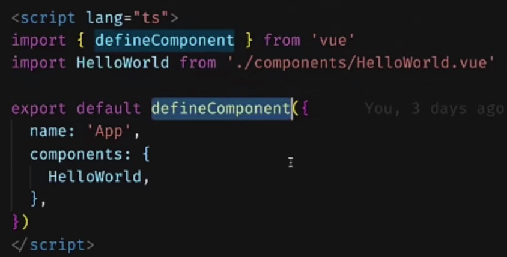
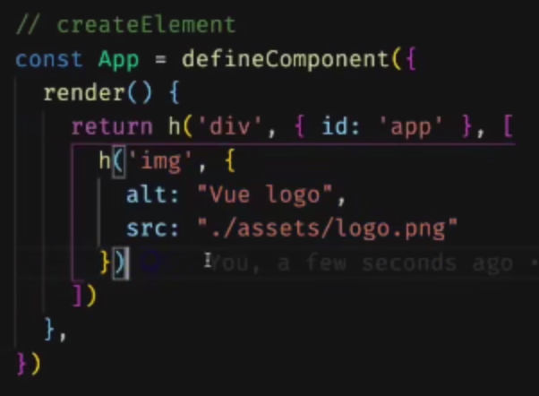
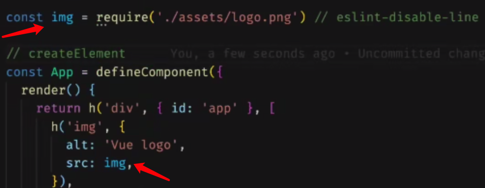

# vue3

## 动态组件

vue2中的动态组件：https://cn.vuejs.org/v2/guide/components-dynamic-async.html

```javascript
// 全局注册
Vue.component(
  'async-webpack-example',
  // 这个动态导入会返回一个 `Promise` 对象。
  () => import('./my-async-component')
)

// 局部注册
new Vue({
  // ...
  components: {
    'my-component': () => import('./my-async-component')
  }
})

// 或使用异步工厂函数
const AsyncComponent = () => ({
  // 需要加载的组件 (应该是一个 `Promise` 对象)
  component: import('./MyComponent.vue'),
  // 异步组件加载时使用的组件
  loading: LoadingComponent,
  // 加载失败时使用的组件
  error: ErrorComponent,
  // 展示加载时组件的延时时间。默认值是 200 (毫秒)
  delay: 200,
  // 如果提供了超时时间且组件加载也超时了，
  // 则使用加载失败时使用的组件。默认值是：`Infinity`
  timeout: 3000
})
```

vue3中的动态组件：https://v3.cn.vuejs.org/guide/migration/async-components.html#_3-x-%E8%AF%AD%E6%B3%95

```javascript
// 由于函数式组件被定义为纯函数，因此异步组件需要通过将其包裹在新的 defineAsyncComponent 助手方法中来显式地定义：
import { defineAsyncComponent } from 'vue'
import ErrorComponent from './components/ErrorComponent.vue'
import LoadingComponent from './components/LoadingComponent.vue'

// 不带选项的异步组件
const asyncModal = defineAsyncComponent(() => import('./Modal.vue'))

// 带选项的异步组件，component更名为loader，异步懒加载的含义更加清晰
const asyncModalWithOptions = defineAsyncComponent({
  loader: () => import('./Modal.vue'),
  delay: 200,
  timeout: 3000,
  errorComponent: ErrorComponent,
  loadingComponent: LoadingComponent
})
```

## debug 用的钩子函数

onRenderTracked

onRenderTriggered

```javascript
onRenderTriggered(event => {console.log(event)})
```

## watch

写在setup里面，不止可以接收一个值，还可以接收一个数组，数组里放多个值

```javascript
setup () {
  watch([value1, value2], (newvalue, oldvalue) => {
    console.log(value1 + value2)
  })
}
```

但是打印出来的reactive对象，是一个proxy，对debug非常不友好

但是如果用类似于data.count这种形式来打印的话，又会使number等类型的值失去响应式，这种值无法被watch

解决的办法是，可以使用getter的方式来监听，也就是使用函数+返回值

```javascript
setup () {
  watch([value1, () => data.count], (newvalue, oldvalue) => {
    console.log(value1 + value2)
  })
}
```


## defineComponent

直接return了传进去的参数

这个函数存在只是为了方便ts




## 函数组件

vue3中的函数组件就是函数，可直接export function……，不像vue2需要添加 ‘functional：true‘

## 源码位置

vue next仓库，它没有跟vue2放在同一个仓库中

## 定义可多文件复用的props踩坑


如上，虽然写了required为true，使用时可看到age的类型依旧是有undefined

解决方法：


原因：

看vue3源码apiDefineComponent.ts，overload4，PropsOptions extends 一个Readonly，上两行的注释有说明原因

需要手动的告诉ts，这个对象是一个readonly。手动告诉就是显示的写上 as const

## h

用来创建节点的，类似于react中的createElement

原生节点：




注意图片的写法：



### 看了h函数的源码会发现，h函数其实就是createVNode函数的一个简单封装

```javascript
export function h(type: any, propsOrChildren?: any, children?: any): VNode {
  const l = arguments.length
  if (l === 2) {
    if (isObject(propsOrChildren) && !isArray(propsOrChildren)) {
      // single vnode without props
      if (isVNode(propsOrChildren)) {
        return createVNode(type, null, [propsOrChildren])
      }
      // props without children
      return createVNode(type, propsOrChildren)
    } else {
      // omit props
      return createVNode(type, null, propsOrChildren)
    }
  } else {
    if (l > 3) {
      children = Array.prototype.slice.call(arguments, 2)
    } else if (l === 3 && isVNode(children)) {
      children = [children]
    }
    return createVNode(type, propsOrChildren, children)
  }
}
```

所以上方的代码写成如下形式也是可以的：


用jsx方式编写的代码编译后是看不到h函数的，因为createVNode函数有一些帮助组件优化渲染的参数

## setup

接收2个参数

1. props
2. 对象
   1. slots
   2. attrs
   3. emit

返回的是一个对象，返回的对象是可直接在模版中使用的

### this

外部能够拿到return出来的数据，通过this

比如在 mounted() 中可以直接用 this.xxx 来使用这些变量

直接用就可以，不用.value

### computed


### 🚩 watchEffect

本质上是一个函数，接收的参数为一个函数

它传入的函数执行过程中用到的reactive、ref、computed数据变化时，会重新执行传入的函数


如上，当nameRef每次变化，都会执行传入的函数进行打印

### setup函数返回render函数的用法

 

这是典型的闭包使用，返回一个函数，函数内用到了上方的变量

它带来了非常多的好处

1. 变量的引用是非常明确的，ts可以提供变量提醒，这里相关的js特性都可以用到。
2. ⚠️ setup只会执行一次。ref变量的变化会引起return出去的函数的重新执行。 


还可以插入带参数的函数，函数中返回特定的 html，不用再像使用指令时写很多代码（比如写 v-if 需要写好几个模板的代码）


jsx 模板中也可使用指令

## props结构

vue3 将 props 的结构拍平了，有利于 jsx 的编写❓

视频 2-8 中间


 


// 此外，与 2.x 不同，loader 函数不再接收 resolve 和 reject 参数，且必须始终返回 Promise

```javascript
// 2.x 版本
const oldAsyncComponent = (resolve, reject) => {
  /* ... */
}

// 3.x 版本
const asyncComponent = defineAsyncComponent(
  () =>
    new Promise((resolve, reject) => {
      /* ... */
    })
)
```
