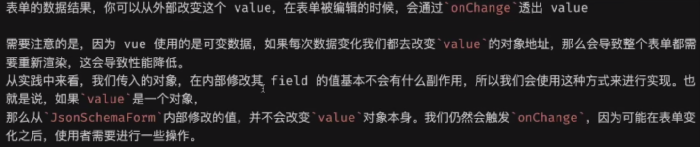
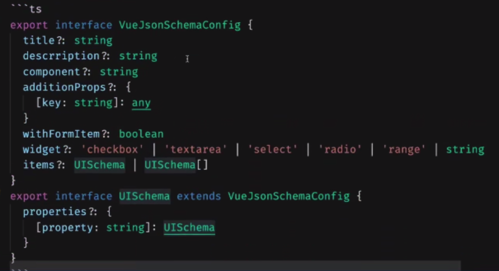
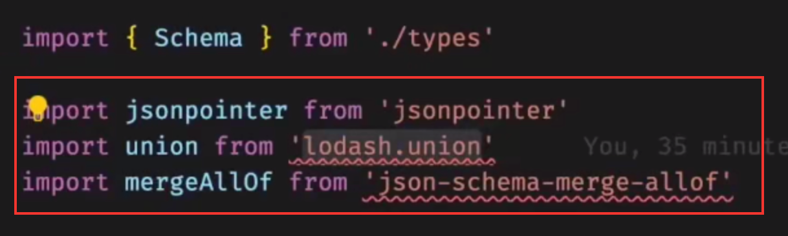

# 开发组件库需要的内容记录

## jsonschema：定义数据


## value：数据




## locale：语言包


## onChange：输入的时候输入内容有变化，调用此 callback


## uiSchema：jsonschema 只是逻辑数据，但是界面也需要有一些交互配置数据




## contextRef

在 vue2 中可以通过 this.$refs.xxx.xxxattr 来访问某个xxx元素的属性值，但是 vue3 使用 compositionAPI。

```tsx
const yourRef = ref({})

<JsonSchemaForm contextRef={yourRef}/>
  
// 在外面就可以用了
onMounted(() => {
  yourRef.value.doSomething()
})
```

## 三个类库，注意一下查一下



## 循环引用问题

object 对象是可以嵌套其它对象的，所以对于入口的分发类型的 A 组件是需要引入 objectItem 的 B 组件，而由于嵌套问题B 组件也需要引入 A 组件再次分发其内部嵌套，所以形成了循环引用。

可以引入 webpack 插件检查循环引用。

### 然后，如何处理循环引用问题呢？

>  vue provide api & inject api

使用以上，在祖先节点提供任何内容，在孙子节点使用祖先节点提供下来的内容。

### 如何保证key唯一性

provide 里的 key 如果写成字符串，那么当它改变时，所有 inject 它的子节点都需要改变硬编码的 key 字符串。

解决：

新建一个 context.ts 文件，里面  `const xxxkey = symbol()` ，然后所有的引用都 import xxxkey 来使用


