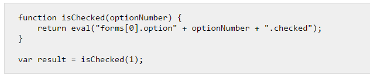
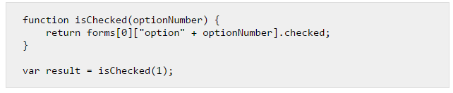

# 前端不常见问题 1

## 尴尬的with

 关于with这个关键字，它的出现本身的出现是为了给代码除了方法以外，可以创建一个独立里作用域，并且可以结构对象属性成为作用域下的变量，减少代码量。而且在一定程度上还能够提升代码的执行效率。但其优势也是其劣势，而且ES5的严格模式下是不能使用的。而ES6的相关语法的出现继承了它的优势，还弥补了一些它的劣势，是不是非常尴尬。接下来具体看看with的优势与劣势：

#### 优势：

with语句可以在不造成性能损失的情况下，减少变量的长度。其造成的附加计算量很少。使用with可以减少读取对象属性的值时，可减少对象命名空间的指针定位。

#### 弊端：

with语句使得程序在查找变量值时，都是先在指定的对象中查找。所以那些本来不是这个对象中的属性的变量查找起来会很慢。如果对性能要求较高的场合，with下面的statement语句中的变量，只应该包含这个指定对象的属性。

上面是从性能方面考虑，接着从代码读写(语义)角度来考虑，with语句打散了对象与属性的关联性（书写和阅读），不利于代码的阅读。

 接着从兼容性角度来考虑，with不能在严格模式下使用；而且还无法向前兼容，而ES6更是有一些语法可以替代with一些功能，比如let可以绑定作用域来替代with生成的作用域等。

```
1 function f(foo, values) {
2     with (foo) {
3         console.log(values)
4     }
5 }
6 f([1,2,3], obj)
```

上面这个示例代码在ES5中没什么问题，但是ES6Array.prototype添加了一个新属性values，所以数组实例将继承这个属性。with语句中的values就变成了[1,2,3].values。

#### 最后为什么with作为一个开发中不被推荐使用的关键字为什么会频繁的出现在面试题中？

如果需要解析with的内部机制和特性就必然会涉及到作用域、变量查找、this指向（如果传入对象上有方法，这个方法内部指向肯定指向这个传入的对象）、ES6、原型链、严格模式、甚至性能问题这些都可以被提及和延申出来，不推荐使用就很大程度上不受关注，也可以考察到面试者对语言底层特性的熟悉程度，这对面试官来说显然是一个不错的问题引入点。

## 为什么不推荐使用 eval

作者：王欣彤
链接：https://www.zhihu.com/question/20591877/answer/57705130
来源：知乎
著作权归作者所有。商业转载请联系作者获得授权，非商业转载请注明出处。


不推荐使用eval的原因有很多，1、eval 太神秘了，以至于很多人用错。所以不推荐使用。      比如这段代码你应该见过：



然而实际上，我们可以这样写：

这并不是eval 不好而是因为容易被用错。eval只是一个普通的函数，只不过他有一个快速通道通向编译器，可以将string变成可执行的代码。有类似功能的还有Function ,  setInterval   和 setTimeout。2、 eval不容易调试。用chromeDev等调试工具无法打断点调试，所以麻烦的东西也是不推荐使用的…3、说到性能问题，在旧的浏览器中如果你使用了eval，性能会下降10倍。在现代浏览器中有两种编译模式：fast path和slow path。fast path是编译那些稳定和可预测（stable and predictable）的代码。而明显的，eval不可预测，所以将会使用slow path ，所以会慢。还有一个是，在使用类似于Closure Compiler等压缩（混淆）代码时，使用eval会报错。（又慢又报错，我还推荐吗？）4、关于安全性，我们经常听到eval是魔鬼，他会引起XSS攻击，实际上，如果我们对信息源有足够的把握时，eval并不会引起很大的安全问题。而且不光是eval，其他方式也可能引起安全问题。比如：   莫名其妙给你注入一个<script src="">标签，或者一段来历不明的JSON-P请求，再或者就是Ajax请求中的eval代码…   所以啊，只要你的信息源不安全，你的代码就不安全。不单单是因为eval引起的。你用eval的时候会在意XSS的问题，你越在意就越出问题，出的多了，eval就成噩梦了。5、效率问题是程序逻辑问题。对于一些有执行字符串代码需求的程序中，不用eval而用其他方式模拟反而会带来更大的开销。附上几篇文章：[JavaScript探秘：eval()是“魔鬼” -- 简明现代魔法](https://link.zhihu.com/?target=http%3A//www.nowamagic.net/librarys/veda/detail/1627) eval是魔鬼。[eval() isn’t evil, just misunderstood](https://link.zhihu.com/?target=http%3A//www.nczonline.net/blog/2013/06/25/eval-isnt-evil-just-misunderstood/)   eval不是魔鬼。到底是不是魔鬼，看看再做决定吧~哦，看到一些说json.parse内部是用eval的，再附上几个链接供大家参考。[javascript - Does JSON.parse() use eval() internally?](https://link.zhihu.com/?target=http%3A//stackoverflow.com/questions/17024136/does-json-parse-use-eval-internally)这是json.parse 源码，大家也且看看娱乐下：[https://code.google.com/p/v8/source/browse/trunk/src/json-parser.h](https://link.zhihu.com/?target=https%3A//code.google.com/p/v8/source/browse/trunk/src/json-parser.h)

[发布于 2015-08-04 11:06](http://www.zhihu.com/question/20591877/answer/57705130)