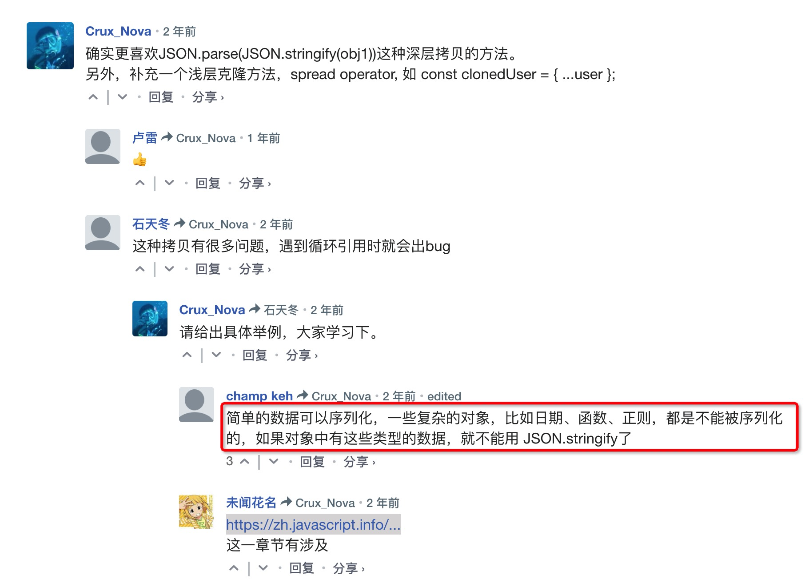

# 对象


简而言之，属性命名没有限制。属性名可以是任何字符串或者 symbol（一种特殊的标志符类型，将在后面介绍）。

其他类型会被自动地转换为字符串。

例如，当数字 `0` 被用作对象的属性的键时，会被转换为字符串 `"0"`：

```javascript
let obj = {
  0: "test" // 等同于 "0": "test"
};

// 都会输出相同的属性（数字 0 被转为字符串 "0"）
alert( obj["0"] ); // test
alert( obj[0] ); // test (相同的属性)
```

这里有个小陷阱：一个名为 `__proto__` 的属性。我们不能将它设置为一个非对象的值：

```javascript
let obj = {};
obj.__proto__ = 5; // 分配一个数字
alert(obj.__proto__); // [object Object] — 值为对象，与预期结果不同
```

我们从代码中可以看出来，把它赋值为 `5` 的操作被忽略了。

我们将在 [后续章节](https://zh.javascript.info/prototype-inheritance) 中学习 `__proto__` 的特殊性质，并给出了 [解决此问题的方法](https://zh.javascript.info/prototype-methods)。


## [属性存在性测试，“in” 操作符](https://zh.javascript.info/object#shu-xing-cun-zai-xing-ce-shi-in-cao-zuo-fu)

```javascript
alert( user.noSuchProperty === undefined ); // true 意思是没有这个属性
alert( "age" in user ); // true，user.age 存在
```

为何会有 `in` 运算符呢？与 `undefined` 进行比较来判断还不够吗？

确实，大部分情况下与 `undefined` 进行比较来判断就可以了。但有一个例外情况，这种比对方式会有问题，但 `in` 运算符的判断结果仍是对的。

那就是属性存在，但存储的值是 `undefined` 的时候：

```javascript
let obj = {
  test: undefined
};

alert( obj.test ); // 显示 undefined，所以属性不存在？

alert( "test" in obj ); // true，属性存在！
```


## [“for…in” 循环](https://zh.javascript.info/object#forin-xun-huan)

为了遍历一个对象的所有键（key），可以使用一个特殊形式的循环：`for..in`。这跟我们在前面学到的 `for(;;)` 循环是完全不一样的东西。

语法：

```javascript
for (key in object) {
  // 对此对象属性中的每个键执行的代码
}
```

例如，让我们列出 `user` 所有的属性：

```javascript
let user = {
  name: "John",
  age: 30,
  isAdmin: true
};

for (let key in user) {
  // keys
  alert( key );  // name, age, isAdmin
  // 属性键的值
  alert( user[key] ); // John, 30, true
}
```

注意，所有的 “for” 结构体都允许我们在循环中定义变量，像这里的 `let key`。

同样，我们可以用其他属性名来替代 `key`。例如 `"for(let prop in obj)"` 也很常用。


### [像对象一样排序](https://zh.javascript.info/object#xiang-dui-xiang-yi-yang-pai-xu)

对象有顺序吗？换句话说，如果我们遍历一个对象，我们获取属性的顺序是和属性添加时的顺序相同吗？这靠谱吗？

简短的回答是：“有特别的顺序”：整数属性会被进行排序，其他属性则按照创建的顺序显示。


## [总结](https://zh.javascript.info/object#zong-jie)

对象是具有一些特殊特性的关联数组。

它们存储属性（键值对），其中：

- 属性的键必须是字符串或者 symbol（通常是字符串）。
- 值可以是任何类型。

我们可以用下面的方法访问属性：

- 点符号: `obj.property`。
- 方括号 `obj["property"]`，方括号允许从变量中获取键，例如 `obj[varWithKey]`。

其他操作：

- 删除属性：`delete obj.prop`。
- 检查是否存在给定键的属性：`"key" in obj`。
- 遍历对象：`for(let key in obj)` 循环。

我们在这一章学习的叫做“普通对象（plain object）”，或者就叫对象。

JavaScript 中还有很多其他类型的对象：

- `Array` 用于存储有序数据集合，
- `Date` 用于存储时间日期，
- `Error` 用于存储错误信息。
- ……等等。

它们有着各自特别的特性，我们将在后面学习到。有时候大家会说“Array 类型”或“Date 类型”，但其实它们并不是自身所属的类型，而是属于一个对象类型即 “object”。它们以不同的方式对 “object” 做了一些扩展。


# 对象引用和复制


## [克隆与合并，Object.assign](https://zh.javascript.info/object-copy#cloning-and-merging-object-assign)

那么，拷贝一个对象变量会又创建一个对相同对象的引用。

但是，如果我们想要复制一个对象，那该怎么做呢？创建一个独立的拷贝，克隆？

这也是可行的，但稍微有点困难，因为 JavaScript 没有提供对此操作的内建的方法。但很少需要这样做 —— 通过引用进行拷贝在大多数情况下已经满足了。

但是，如果我们真的想要这样做，那么就需要创建一个新对象，并通过遍历现有属性的结构，在原始类型值的层面，将其复制到新对象，以复制已有对象的结构。

就像这样：

```javascript
let user = {
  name: "John",
  age: 30
};

let clone = {}; // 新的空对象

// 将 user 中所有的属性拷贝到其中
for (let key in user) {
  clone[key] = user[key];
}
```

我们也可以使用 [Object.assign](https://developer.mozilla.org/en-US/docs/Web/JavaScript/Reference/Global_Objects/Object/assign) 方法来达成同样的效果。

语法是：

```javascript
Object.assign(dest, [src1, src2, src3...])
```

- 第一个参数 `dest` 是指目标对象。
- 更后面的参数 `src1, ..., srcN`（可按需传递多个参数）是源对象。
- 该方法将所有源对象的属性拷贝到目标对象 `dest` 中。换句话说，从第二个开始的所有参数的属性都被拷贝到第一个参数的对象中。
- 调用结果返回 `dest`。

例如，我们可以用它来合并多个对象：

```javascript
let user = { name: "John" };

let permissions1 = { canView: true };
let permissions2 = { canEdit: true };

// 将 permissions1 和 permissions2 中的所有属性都拷贝到 user 中
Object.assign(user, permissions1, permissions2);

// 现在 user = { name: "John", canView: true, canEdit: true }
```

如果被拷贝的属性的属性名已经存在，那么它会被覆盖：

```javascript
let user = { name: "John" };

Object.assign(user, { name: "Pete" });

alert(user.name); // 现在 user = { name: "Pete" }
```

我们也可以用 `Object.assign` 代替 `for..in` 循环来进行简单克隆：

```javascript
let user = {
  name: "John",
  age: 30
};

let clone = Object.assign({}, user);
```

它将 `user` 中的所有属性拷贝到了一个空对象中，并返回这个新的对象。

还有其他克隆对象的方法，例如使用 [spread 语法](https://zh.javascript.info/rest-parameters-spread) `clone = {...user}`，在后面的章节中我们会讲到。


## [深层克隆](https://zh.javascript.info/object-copy#shen-ceng-ke-long)

“深拷贝” 我们可以使用递归来实现它。或者为了不重复造轮子，采用现有的实现，例如 [lodash](https://lodash.com/) 库的 [_.cloneDeep(obj)](https://lodash.com/docs#cloneDeep)。

**使用 const 声明的对象也是可以被修改的**

通过引用对对象进行存储的一个重要的副作用是声明为 `const` 的对象 **可以** 被修改。

例如：

```javascript
const user = {
  name: "John"
};

user.name = "Pete"; // (*)

alert(user.name); // Pete
```

看起来 `(*)` 行的代码会触发一个错误，但实际并没有。`user` 的值是一个常量，它必须始终引用同一个对象，但该对象的属性可以被自由修改。

换句话说，只有当我们尝试将 `user=...` 作为一个整体进行赋值时，`const user` 才会报错。

⚠️ 也就是说，如果我们真的需要创建常量对象属性，也是可以的，但使用的是完全不同的方法。我们将在 [属性标志和属性描述符](https://zh.javascript.info/property-descriptors) 一章中学习它。



https://zh.javascript.info/json


# 垃圾回收


一些优化建议：

- **分代收集（Generational collection）**—— 对象被分成两组：“新的”和“旧的”。许多对象出现，完成它们的工作并很快死去，它们可以很快被清理。那些长期存活的对象会变得“老旧”，而且被检查的频次也会减少。
- **增量收集（Incremental collection）**—— 如果有许多对象，并且我们试图一次遍历并标记整个对象集，则可能需要一些时间，并在执行过程中带来明显的延迟。所以引擎试图将垃圾收集工作分成几部分来做。然后将这几部分会逐一进行处理。这需要它们之间有额外的标记来追踪变化，但是这样会有许多微小的延迟而不是一个大的延迟。
- **闲时收集（Idle-time collection）**—— 垃圾收集器只会在 CPU 空闲时尝试运行，以减少可能对代码执行的影响。

如果你熟悉底层（low-level）编程，关于 V8 引擎垃圾回收器的更详细信息请参阅文章 [V8 之旅：垃圾回收](http://jayconrod.com/posts/55/a-tour-of-v8-garbage-collection)。

[V8 博客](http://v8project.blogspot.com/) 还不时发布关于内存管理变化的文章。当然，为了学习垃圾收集，你最好通过学习 V8 引擎内部知识来进行准备，并阅读一个名为 [Vyacheslav Egorov](http://mrale.ph/) 的 V8 引擎工程师的博客。我之所以说 “V8”，因为网上关于它的文章最丰富的。对于其他引擎，许多方法是相似的，但在垃圾收集上许多方面有所不同。


# 对象方法，"this"


### [方法简写](https://zh.javascript.info/object-methods#fang-fa-jian-xie)

```javascript
// 这些对象作用一样

user = {
  sayHi: function() {
    alert("Hello");
  }
};

// 方法简写看起来更好，对吧？
let user = {
  sayHi() { // 与 "sayHi: function(){...}" 一样
    alert("Hello");
  }
};
```

如上所示，我们可以省略 `"function"`，只写 `sayHi()`。

说实话，这种表示法还是有些不同。在对象继承方面有一些细微的差别（稍后将会介绍），但目前它们并不重要。在几乎所有的情况下，较短的语法是首选的。


# 构造器和操作符 "new"

换句话说，`new User(...)` 做的就是类似的事情：

```javascript
function User(name) {
  // this = {};（隐式创建）

  // 添加属性到 this
  this.name = name;
  this.isAdmin = false;

  // return this;（隐式返回）
}
```

**new function() { … }**

如果我们有许多行用于创建单个复杂对象的代码，我们可以将它们封装在一个立即调用的构造函数中，像这样：

```javascript
// 创建一个函数并立即使用 new 调用它
let user = new function() {
  this.name = "John";
  this.isAdmin = false;

  // ……用于用户创建的其他代码
  // 也许是复杂的逻辑和语句
  // 局部变量等
};
```

这个构造函数不能被再次调用，因为它不保存在任何地方，只是被创建和调用。因此，这个技巧旨在封装构建单个对象的代码，而无需将来重用。

## [构造器模式测试：new.target](https://zh.javascript.info/constructor-new#gou-zao-qi-mo-shi-ce-shi-newtarget)

**进阶内容**

本节涉及的语法内容很少使用，除非你想了解所有内容，否则你可以直接跳过该语法。

在一个函数内部，我们可以使用 `new.target` 属性来检查它是否被使用 `new` 进行调用了。

对于常规调用，它为 undefined，对于使用 `new` 的调用，则等于该函数：

```javascript
function User() {
  alert(new.target);
}

// 不带 "new"：
User(); // undefined

// 带 "new"：
new User(); // function User { ... }
```

它可以被用在函数内部，来判断该函数是被通过 `new` 调用的“构造器模式”，还是没被通过 `new` 调用的“常规模式”。

我们也可以让 `new` 调用和常规调用做相同的工作，像这样：

```javascript
function User(name) {
  if (!new.target) { // 如果你没有通过 new 运行我
    return new User(name); // ……我会给你添加 new
  }

  this.name = name;
}

let john = User("John"); // 将调用重定向到新用户
alert(john.name); // John
```

这种方法有时被用在库中以使语法更加灵活。这样人们在调用函数时，无论是否使用了 `new`，程序都能工作。

不过，到处都使用它并不是一件好事，因为省略了 `new` 使得很难观察到代码中正在发生什么。而通过 `new` 我们都可以知道这创建了一个新对象。

## [构造器的 return](https://zh.javascript.info/constructor-new#gou-zao-qi-de-return)

通常，构造器没有 `return` 语句。它们的任务是将所有必要的东西写入 `this`，并自动转换为结果。

但是，如果这有一个 `return` 语句，那么规则就简单了：

- 如果 `return` 返回的是一个对象，则返回这个对象，而不是 `this`。
- 如果 `return` 返回的是一个原始类型，则忽略。

换句话说，带有对象的 `return` 返回该对象，在所有其他情况下返回 `this`。

例如，这里 `return` 通过返回一个对象覆盖 `this`：

```javascript
function BigUser() {

  this.name = "John";

  return { name: "Godzilla" };  // <-- 返回这个对象
}

alert( new BigUser().name );  // Godzilla，得到了那个对象
```

这里有一个 `return` 为空的例子（或者我们可以在它之后放置一个原始类型，没有什么影响）：

```javascript
function SmallUser() {

  this.name = "John";

  return; // <-- 返回 this
}

alert( new SmallUser().name );  // John
```

通常构造器没有 `return` 语句。这里我们主要为了完整性而提及返回对象的特殊行为。

**省略括号**

顺便说一下，如果没有参数，我们可以省略 `new` 后的括号：

```javascript
let user = new User; // <-- 没有参数
// 等同于
let user = new User();
```

这里省略括号不被认为是一种“好风格”，但是规范允许使用该语法。

## [总结](https://zh.javascript.info/constructor-new#zong-jie)

- 构造函数，或简称构造器，就是常规函数，但大家对于构造器有个共同的约定，就是其命名首字母要大写。
- 构造函数只能使用 `new` 来调用。这样的调用意味着在开始时创建了空的 `this`，并在最后返回填充了值的 `this`。

我们可以使用构造函数来创建多个类似的对象。

JavaScript 为许多内建的对象提供了构造函数：比如日期 `Date`、集合 `Set` 以及其他我们计划学习的内容。

**对象，我们还会回来哒！**

在本章中，我们只介绍了关于对象和构造器的基础知识。它们对于我们在下一章中，学习更多关于数据类型和函数的相关知识非常重要。

在我们学习了那些之后，我们将回到对象，在 [原型，继承](https://zh.javascript.info/prototypes) 和 [类](https://zh.javascript.info/classes) 章节中深入介绍它们。


# 可选链 "?."


